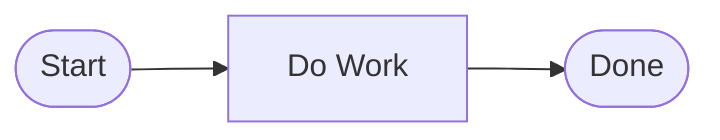
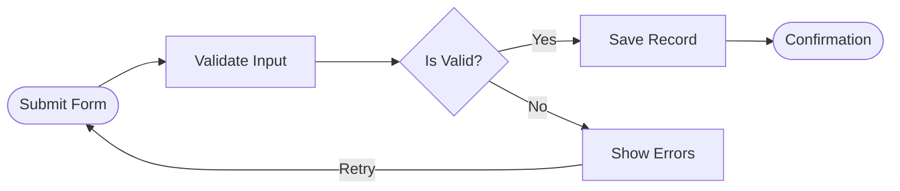

# Flowchart Mermaid Generation Skill

Generate valid Mermaid for the city-sim-ai flowchart visualizer. The app now uses Mermaid as the authoring format and converts it into the internal node/link schema for rendering with React Flow.

## Mermaid Contract

The flowchart must start with a Mermaid flowchart header:

```mermaid
flowchart LR
```

Use a conservative Mermaid subset that matches the app's supported node types.

## Supported Node Shapes

Each node must use an id followed by one of the supported Mermaid shapes.

| Flowchart Type | Mermaid Syntax | Example                  | Notes                           |
| -------------- | -------------- | ------------------------ | ------------------------------- |
| `terminator`   | `([label])`    | `A([Start])`             | Use for start/end nodes         |
| `process`      | `[label]`      | `B[Validate Input]`      | Standard step                   |
| `decision`     | `{label}`      | `C{Is Valid?}`           | Use with labeled outgoing links |
| `subflow`      | `[[label]]`    | `D[[Run Subflow]]`       | Delegated process               |
| `group`        | `((label))`    | `E((Phase One))`         | Logical grouping step           |
| `note`         | `[/label/]`    | `N[/Requires approval/]` | Annotation-only node            |

## Edge Syntax

| Purpose        | Mermaid Syntax | Example   |
| -------------- | -------------- | --------- | --- | ------ | --- | --- |
| Unlabeled edge | `-->`          | `A --> B` |
| Labeled edge   | `-->           | label     | `   | `C --> | Yes | D`  |

## Id Rules

- Node ids must start with a letter.
- After the first letter, use only letters, numbers, underscores, or dashes.
- Good ids: `A`, `START`, `ERR_1`, `retry-loop`
- Bad ids: `1A`, `node space`, `A/B`

## Layout Rules

The renderer still computes positions automatically from the parsed graph. Follow these rules for predictable output:

1. Use `flowchart LR` for the default left-to-right flow.
2. Keep the primary path mostly linear: `A --> B --> C --> D`.
3. Decision nodes should have two or more labeled outgoing links.
4. Notes should usually be leaf nodes connected with an optional label like `info`.
5. Use terminator nodes for the beginning and end of the process.
6. Every referenced id must exist as a Mermaid node.

## Examples

### Minimal Flow



### Decision with Branches and Loop



### Using All Supported Node Types


## Common Mistakes to Avoid

- Missing the header: always start with `flowchart LR` unless you intentionally need a different Mermaid direction.
- Using unsupported Mermaid shapes or advanced constructs not covered by this skill.
- Using invalid node ids with spaces or punctuation.
- Omitting labels on decision branches.
- Writing long paragraph labels inside standard nodes. Use note nodes for caveats or annotations.
- Referring to node ids in edges that were never defined.

## Choosing the Right Shape

| You want to represent…                       | Use Mermaid shape |
| -------------------------------------------- | ----------------- |
| The beginning or end of the entire flow      | `([label])`       |
| A regular action, task, or step              | `[label]`         |
| A yes/no question or conditional branch      | `{label}`         |
| A delegated sub-process or external workflow | `[[label]]`       |
| A logical grouping, phase, or category       | `((label))`       |
| A comment, caveat, or side-note              | `[/label/]`       |

## Output Requirements

- Return only Mermaid when asked to generate a flowchart.
- Keep labels short and readable.
- Prefer `flowchart LR` unless the user explicitly asks for a different direction.
- Stay within the supported subset so the app can parse and render the result without fallback behavior.
