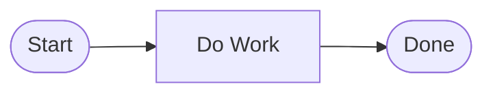
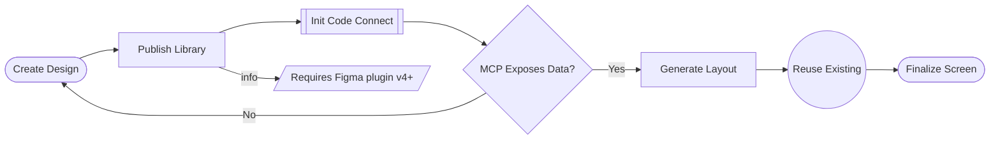

# Flowchart Mermaid Generation Skill

Generate valid Mermaid for the city-sim-ai flowchart visualizer. The app now uses Mermaid as the authoring format and converts it into the internal node/link schema for rendering with React Flow.

## Supported Contract

The tool intentionally supports a small Mermaid subset. Stay inside that subset.

### Header

Start with exactly one header line:

```mermaid
flowchart LR
```

Accepted header keywords:

- `flowchart`
- `graph`

Accepted directions:

- `LR`
- `RL`
- `TB`
- `TD`
- `BT`

Use `flowchart LR` unless the user explicitly needs a different top-level direction token. The parser preserves these standard directions, but the canvas layout is still controlled separately inside the app, so `LR` is the safest default.

### Supported Line Forms

After the header, use only these line shapes:

```text
<node-id><node-shape>
<source-id> --> <target-id>
<source-id> -->|label| <target-id>
<source-id> -- label --> <target-id>
%% comment
```

Do not chain links or mix multiple declarations on one line.

Quoted labels are supported when needed, for example:

```mermaid
A["Check [Draft] State"]
B -->|"Needs [Review]"| C
C -- "Ready For Review" --> D
```

Limited compatibility aliases are also accepted on input for copy-pasted Mermaid:

```mermaid
A@{ shape: stadium, label: Start }
B@{ shape: rect, label: Validate Input }
C@{ shape: diamond, label: Is Valid? }
```

Prefer the canonical bracket forms when generating new Mermaid. Alias syntax is for compatibility, not the preferred output style.

## Supported Node Shapes

Each node must use an id followed by one of the supported Mermaid shapes.

| Flowchart Type | Mermaid Syntax | Example                  | Notes                           |
| -------------- | -------------- | ------------------------ | ------------------------------- |
| `terminator`   | `([label])`    | `A([Start])`             | Use for start/end nodes         |
| `process`      | `[label]`      | `B[Validate Input]`      | Standard step                   |
| `decision`     | `{label}`      | `C{Is Valid?}`           | Use with labeled outgoing links |
| `subflow`      | `[[label]]`    | `D[[Run Subflow]]`       | Delegated process               |
| `group`        | `((label))`    | `E((Phase One))`         | Logical grouping step           |
| `note`         | `[/label/]`    | `N[/Requires approval/]` | Annotation-only node            |

Accepted alias shapes on input:

- `stadium` -> `terminator`
- `rect`, `rectangle` -> `process`
- `diamond` -> `decision`
- `subproc` -> `subflow`
- `dbl-circ`, `double-circle` -> `group`

## Edge Syntax

- Unlabeled edge: `A --> B`
- Canonical labeled edge: `C -->|Yes| D`
- Accepted compatibility form on input: `C -- Yes --> D`

Generate the canonical pipe form by default. The spaced label form is accepted for compatibility when parsing existing Mermaid.

Do not use dotted, thick, open, circle, cross, bidirectional, or invisible edges.

## Id Rules

- Node ids must start with a letter.
- After the first letter, use only letters, numbers, underscores, or dashes.
- Good ids: `A`, `START`, `ERR_1`, `retry-loop`
- Bad ids: `1A`, `node space`, `A/B`

When you declare a node explicitly, always keep the id and shape together on the same line:

```mermaid
A([Start])
B[Validate Input]
C{Is Valid?}
```

## Layout Rules

The renderer still computes positions automatically from the parsed graph. Follow these rules for predictable output:

1. Use `flowchart LR` for the default left-to-right flow.
2. Keep the primary path mostly linear: `A --> B --> C --> D`.
3. Decision nodes should have two or more labeled outgoing links.
4. Notes should usually be leaf nodes connected with an optional label like `info`.
5. Use terminator nodes for the beginning and end of the process.
6. Every referenced id must exist as a Mermaid node.

## Unsupported In This Tool

Do not generate any of the following for this app:

- chained links such as `A --> B --> C`
- fan-out or fan-in syntax such as `A & B --> C`
- arbitrary `@{ shape: ... }` declarations outside the small supported alias list
- subgraphs
- classes, styles, `linkStyle`, or curve settings
- markdown strings
- icon or image nodes
- click handlers or interaction features
- edge ids or edge metadata blocks

## Examples

### Minimal Flow



### Decision with Branches and Loop


### Using All Supported Node Types



## Mermaid Hazards

- Avoid lowercase `end` as node text. Mermaid treats `end` specially in broader flowchart syntax. Prefer `Finish`, `Done`, or `End Step`.
- Avoid writing `A---oB` or `A---xB` style edges. In Mermaid those can become special edge types. Use plain `-->` instead.
- If a label contains punctuation that may confuse parsing, prefer simple words now. Quoted labels are safer in general Mermaid, but this tool's current contract is easiest to keep reliable with short unquoted labels.

## Common Mistakes To Avoid

- Missing the header: always start with `flowchart LR` unless you intentionally need a different Mermaid direction.
- Using unsupported Mermaid shapes or advanced constructs not covered by this skill.
- Using invalid node ids with spaces or punctuation.
- Omitting labels on decision branches.
- Writing long paragraph labels inside standard nodes. Use note nodes for caveats or annotations.
- Referring to node ids in edges that were never defined.

## Choosing the Right Shape

| You want to represent…                       | Use Mermaid shape |
| -------------------------------------------- | ----------------- |
| The beginning or end of the entire flow      | `([label])`       |
| A regular action, task, or step              | `[label]`         |
| A yes/no question or conditional branch      | `{label}`         |
| A delegated sub-process or external workflow | `[[label]]`       |
| A logical grouping, phase, or category       | `((label))`       |
| A comment, caveat, or side-note              | `[/label/]`       |

## Output Requirements

- Return only Mermaid when asked to generate a flowchart.
- Keep labels short and readable.
- Prefer `flowchart LR` unless the user explicitly asks for a different direction.
- Stay within the supported subset so the app can parse and render the result without fallback behavior.
