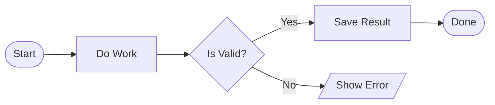

# Flowchart Mermaid Supported Syntax

This is the operational contract for the flowchart tool. It is narrower than full Mermaid flowchart syntax.

## Supported Now

| Construct                         | Status    | Notes                                                                                              |
| --------------------------------- | --------- | -------------------------------------------------------------------------------------------------- |
| `flowchart <dir>` header          | Supported | Standard directions supported: `LR`, `RL`, `TB`, `TD`, `BT`. Prefer `flowchart LR`.                |
| `graph <dir>` header              | Supported | Accepted with the same standard directions, but `flowchart LR` is the safer default.               |
| One node declaration per line     | Supported | Use one id plus one supported shape.                                                               |
| `-->` unlabeled edge              | Supported | Example: `A --> B`                                                                                 |
| `-->\|label\|` labeled edge       | Supported | Example: `A -->\|Yes\| B`                                                                          |
| `-- label -->` labeled edge       | Supported | Input compatibility only. Formatter normalizes back to `-->\|label\|`.                             |
| Quoted node labels                | Supported | Example: `A["Check [Draft] State"]`                                                                |
| Quoted edge labels                | Supported | Example: `A -->\|"Needs [Review]"\| B`                                                             |
| Limited `@{ shape: ... }` aliases | Supported | Only the small alias list below is accepted. Formatter normalizes back to canonical bracket forms. |
| `%%` comments                     | Supported | Use for sectioning samples and prompts.                                                            |
| Simple node ids                   | Supported | Must start with a letter, then letters, digits, `_`, or `-`.                                       |

## Supported Node Shapes

| Semantic Type | Mermaid Form | Example                  |
| ------------- | ------------ | ------------------------ |
| Terminator    | `([label])`  | `A([Start])`             |
| Process       | `[label]`    | `B[Validate Input]`      |
| Decision      | `{label}`    | `C{Is Valid?}`           |
| Subflow       | `[[label]]`  | `D[[Run Subflow]]`       |
| Group         | `((label))`  | `E((Phase One))`         |
| Note          | `[/label/]`  | `N[/Requires approval/]` |

## Accepted Alias Shapes

| Alias Shape                 | Maps To    | Example                                    |
| --------------------------- | ---------- | ------------------------------------------ |
| `stadium`                   | Terminator | `A@{ shape: stadium, label: Start }`       |
| `rect`, `rectangle`         | Process    | `B@{ shape: rect, label: Validate Input }` |
| `diamond`                   | Decision   | `C@{ shape: diamond, label: Is Valid? }`   |
| `subproc`                   | Subflow    | `D@{ shape: subproc, label: Run Subflow }` |
| `dbl-circ`, `double-circle` | Group      | `E@{ shape: dbl-circ, label: Phase One }`  |

These aliases are input compatibility only. Formatted or regenerated Mermaid still uses the canonical bracket forms.

## Explicitly Unsupported Now

| Construct                                              | Status      | Why It Is Out Of Scope                                                   |
| ------------------------------------------------------ | ----------- | ------------------------------------------------------------------------ |
| Chained links                                          | Unsupported | The tool expects one edge per line.                                      |
| `A & B --> C` fan-out/fan-in                           | Unsupported | Does not match the current parser contract.                              |
| Dotted, thick, open, circle, cross, or invisible edges | Unsupported | The internal edge model is still plain directed links.                   |
| `@{ shape: ... }` syntax outside the small alias list  | Unsupported | The tool only maps a limited alias set into the existing six node types. |
| Subgraphs                                              | Unsupported | Requires broader structure semantics than the current model.             |
| Classes, styles, `linkStyle`, curves                   | Unsupported | Styling is not part of the current authoring contract.                   |
| Markdown strings                                       | Unsupported | Not part of the current parser subset.                                   |
| Icon or image nodes                                    | Unsupported | External visual semantics are intentionally excluded.                    |
| Click handlers or interactions                         | Unsupported | The tool is not exposing Mermaid interaction features.                   |
| Edge ids or metadata blocks                            | Unsupported | The internal link model does not preserve them.                          |

## Known Authoring Hazards

| Hazard                                  | Recommendation                                    |
| --------------------------------------- | ------------------------------------------------- |
| lowercase `end` in labels               | Avoid it; prefer `Finish`, `Done`, or `End Step`. |
| `o` or `x` edge variants                | Use plain `-->` only.                             |
| punctuation-heavy labels                | Keep labels short and simple for now.             |
| invalid ids such as `1A` or `node name` | Use `A`, `STEP_1`, or `retry-loop` instead.       |

## Candidate Later Additions

These are not supported in Track A, but they are reasonable later-phase candidates if they map cleanly to the current internal model.

| Construct | Later-Phase Fit |
| --------- | --------------- |

## Safe Prompt Pattern

